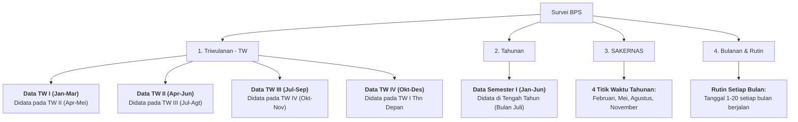

# 🎨 Dokumen Desain Sistem & Arsitektur UI — KANVAS SULA / STATIVA
**Badan Pusat Statistik Kabupaten Kepulauan Sula**

---

## 📌 1. Identitas & Filosofi Desain

**KANVAS SULA** (*Katalog dan Navigasi Visual Aktivitas Statistik BPS Kab. Kepulauan Sula*) dirancang dengan filosofi **Clean Modern Corporate Pastel**:
- **Pendekatan Visual:** Bersih, ramah mata, profesional, dan berorientasi data statistik (*data-dense yet breathable*).
- **Standar Aksesibilitas:** Memenuhi standar kontras **WCAG AA** untuk kenyamanan membaca publik dan pegawai BPS.
- **Arsitektur Layout:** *Single Page Application* (SPA) dengan *hash routing* terpadu, transisi halus, dan animasi *reveal-on-scroll*.

---

## 🎨 2. Palet Warna & Design Tokens

### **A. Warna Utama (Corporate Pastel)**
```css
:root {
  --color-soft-blue: #9ECAD6;       /* Lembut, ramah, melambangkan keterbukaan data */
  --color-muted-indigo: #748DAE;    /* Elegan, stabil, aksen navigasi & heading */
  --color-blush-pink: #F5CBCB;      /* Kehangatan pelayanan publik BPS */
  --color-light-rose: #FFEAEA;      /* Latar aksen lembut */
  
  --color-text-primary: #1E293B;    /* Slate 800 — teks utama kontras tinggi */
  --color-text-secondary: #475569;  /* Slate 600 — subjudul & deskripsi */
  --color-text-muted: #64748B;      /* Slate 500 — label & caption */
  --color-surface-white: #FFFFFF;
  --color-surface-subtle: #F8FAFC;  /* Slate 50 */
  --color-border: #E2E8F0;          /* Slate 200 */
}
```

### **B. Identitas Warna 5 Pilar Tim Teknis BPS**
Setiap tim memiliki kode warna pastel unik untuk mempermudah navigasi visual:

| Tim Teknis | Background Badge | Border Accent | Teks / Solid Accent |
| :--- | :--- | :--- | :--- |
| **1. Statistik Sosial** | `#EFF6FF` (Blue-50) | `#BFDBFE` (Blue-200) | `#1D4ED8` (Blue-700) |
| **2. Statistik Produksi** | `#F0FDF4` (Green-50) | `#BBF7D0` (Green-200) | `#15803D` (Green-700) |
| **3. Statistik Distribusi** | `#FFF7ED` (Orange-50) | `#FED7AA` (Orange-200) | `#C2410C` (Orange-700) |
| **4. Neraca Wilayah (NWAS)** | `#FAF5FF` (Purple-50) | `#E9D5FF` (Purple-200) | `#7E22CE` (Purple-700) |
| **5. Tim IPDS (TI & Diseminasi)**| `#F0FDFA` (Teal-50) | `#99F6E4` (Teal-200) | `#0F766E` (Teal-700) |

---

## 🔤 3. Tipografi

Sistem tipografi menggunakan 3 font Google pilihan:
1. **Display & Heading:** `Plus Jakarta Sans` (font modern, geometris, berkarakter tegas).
2. **Body Text & UI:** `Inter` (standar keterbacaan tinggi untuk tabel dan teks naratif).
3. **Angka, Kode & Metadata:** `JetBrains Mono` (font monospace presisi untuk kode wilayah, ID survei, nomor baris, dan persentase).

---

## 📊 4. Siklus & Jadwal Metodologi Pendataan BPS

Desain membedakan secara tegas antara **Periode Pelaksanaan Lapangan** dengan **Periode Referensi Data**:



### **Disclaimer Metodologi & Durasi Pelaksanaan Lapangan BPS:**
- **Survei Triwulanan (SERUTI, IMK Triwulanan, SKLNPT, dll.):**
  - **Bukan berjalan selama 3 bulan penuh**, melainkan pencacahan lapangan berlangsung selama **1 bulan** di awal triwulan berikutnya (misal: Data TW 1 Januari–Maret didata pada **Bulan April**). Hal ini dilakukan agar seluruh pencatatan transaksi, operasional, dan pembukuan 3 bulan sebelumnya sudah komplit saat didata.
- **Survei Tahunan (PODES, IMK Tahunan, Konstruksi Tahunan, dll.):**
  - Dilaksanakan selama **1 bulan pencacahan** di pertengahan tahun (**Bulan Juli**) untuk merekam periode rujukan Semester 1 (Januari–Juni) atau tahun buku berjalan.
- **SAKERNAS (Survei Angkatan Kerja Nasional):**
  - Dilaksanakan sebanyak 4 putaran berkala dalam setahun, dengan durasi pencacahan masing-masing **1 bulan** pada: **Februari, Mei, Agustus, dan November**.
- **Survei Bulanan (SHPB / Harga Pasar, Ubinan Subround, KSA):**
  - Pencacahan rutin setiap bulan pada rentang tanggal tertentu (misal tgl 1–20 setiap bulan).

---

## 🧩 5. Komponen UI Utama

1. **Katalog Tabel Kegiatan Statistik (5 Pilar Tim):**
   - Menampilkan nomor baris, nama & akronim kegiatan, kolom jadwal bulan pelaksanaan, platform pengumpulan data (FASIH / Manual), dan tombol detail.
2. **Halaman Detail Khusus Survei (Level 4):**
   - Breadcrumb rapi simetris dengan tombol kembali.
   - Card 1: Latar Belakang & Tujuan Pokok.
   - Card 2: Ruang Lingkup & Metodologi Pelaksanaan.
   - Card 3: **Jadwal & Siklus Pendataan Lapangan (Timeline & Referensi Data)**.
   - Card 4: Indikator & Publikasi yang Dihasilkan.
   - Card 5: Dokumen & Kuesioner Resmi Terkait.
   - Card 6: Monitoring & Rekapitulasi Progres Lapangan (Sync FASIH CAPI).
3. **Modal Autentikasi Organik BPS:**
   - Akses aman bagi petugas organik BPS untuk input manual, monitoring, dan sinkronisasi scraper.

